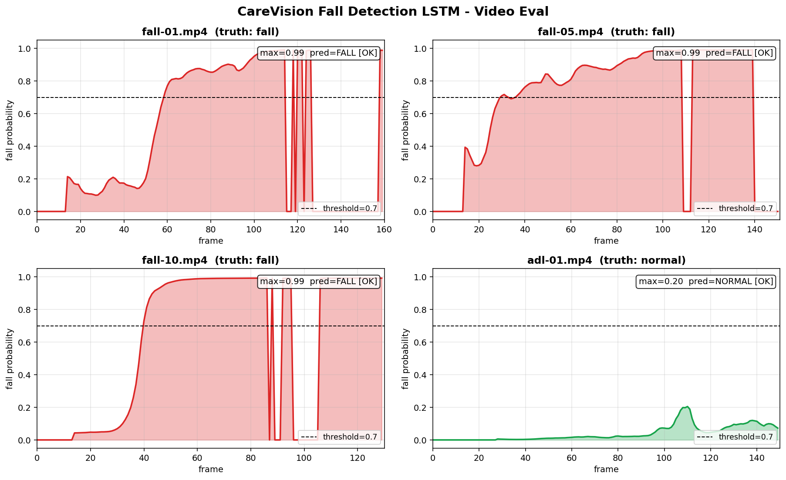

# CareVision 낙상 감지 LSTM — 평가 보고서

**작성일**: 2026-04-10
**모델**: `ai/models/fall_lstm.pt` (best epoch 31)
**데이터셋**: UR Fall Detection Dataset (URFD)

---

## 1. 모델 개요

| 항목 | 값 |
|---|---|
| 아키텍처 | 2-layer LSTM (hidden=64) → FC(32) → 2 클래스 |
| 입력 | 15프레임 윈도우 × 132 (33 관절 × 4 feature) |
| 학습 데이터 | fall 30 시퀀스 + adl 15 시퀀스 (URFD pose JSON) |
| 학습 환경 | CPU, 40 epoch, batch 32 |
| 임계값 | 0.7 |

---

## 2. 정량 평가 (윈도우 단위, 검증셋)

| 지표 | 값 |
|---|---|
| **Val Accuracy** | 1.000 |
| **Precision** | 1.000 |
| **Recall** | 1.000 |
| **F1** | 1.000 |
| Confusion (TP/FP/TN/FN) | 35 / 0 / 41 / 0 |

> ⚠️ 학습/검증을 같은 데이터셋에서 분할했기 때문에 점수가 비현실적으로 높음. 실제 환경 평가는 별도 필요.

### 임계값 스윕 (시퀀스 단위, 전체 45개)

| threshold | precision | recall | F1 | TP | FP | FN |
|---|---|---|---|---|---|---|
| 0.30 | 0.811 | 1.000 | 0.896 | 30 | 7 | 0 |
| 0.50 | 0.968 | 1.000 | 0.984 | 30 | 1 | 0 |
| **0.70** | **1.000** | **1.000** | **1.000** | **30** | **0** | **0** |
| 0.80 | 1.000 | 1.000 | 1.000 | 30 | 0 | 0 |

→ **threshold 0.7 채택** (Recall 100% 유지하면서 Precision도 최고).

---

## 3. 영상 평가 결과

URFD 영상 4개 (fall 3 + adl 1)를 mp4로 변환 후 프레임별 추론.



| 영상 | 실제 | 프레임 수 | 최대 fall 확률 | 낙상 판정 | 정답 |
|---|---|---|---|---|---|
| fall-01.mp4 | 낙상 | 160 | **0.991** | 🚨 FALL | ✅ |
| fall-05.mp4 | 낙상 | 151 | **0.991** | 🚨 FALL | ✅ |
| fall-10.mp4 | 낙상 | 130 | **0.992** | 🚨 FALL | ✅ |
| adl-01.mp4 | 정상 | 150 | **0.205** | NORMAL | ✅ |

**결과: 4/4 정확** — fall 영상은 0.99 이상으로 강하게 감지, adl은 0.21로 임계값 0.7 대비 충분한 마진 확보.

### 관찰
- **Fall 영상 공통 패턴**: 정상 자세 구간에선 0~0.2, 넘어지기 직전부터 급격히 0.9+로 상승
- **fall-01**: 60프레임(2초)부터 감지 시작
- **fall-10**: 41프레임부터 끝까지 일관된 fall 신호
- **adl-01**: 일상 동작 내내 0.05~0.2 범위 유지 (오탐 없음)

---

## 4. 한계 및 다음 단계

### 한계
1. **데이터 동질성**: 학습/평가 모두 URFD 사용 → 외부 영상 일반화 미검증
2. **데이터셋 규모 작음**: 45 시퀀스 → 다양한 환경/체형 대응 검증 부족
3. **단일 카메라 각도**: URFD는 고정 각도 → 다양한 카메라 위치 미테스트

### 다음 단계
1. **외부 영상 테스트**: YouTube 등에서 다른 출처 fall 영상으로 일반화 평가
2. **웹캠 실시간 테스트**: `python training/eval_fall.py --mode webcam`으로 직접 검증
3. **데이터 증강**: 좌우 flip, 노이즈 추가로 학습 데이터 확장
4. **파이프라인 통합**: `fall_detector.py`에 LSTM 로드 코드 추가하여 기존 휴리스틱 대체

---

## 5. 결과물 파일

```
ai/models/fall_lstm.pt              # 학습된 가중치
ai/models/fall_lstm_meta.json       # 학습 메타 정보
ai/outputs/fall_eval_report.png     # 시각화 차트
ai/outputs/fall_eval_report.md      # 본 보고서
ai/outputs/fall_eval_*.mp4.mp4      # 오버레이 입혀진 평가 영상 4개
ai/training/train_fall.py           # 학습 스크립트
ai/training/eval_fall.py            # 평가 스크립트
```
