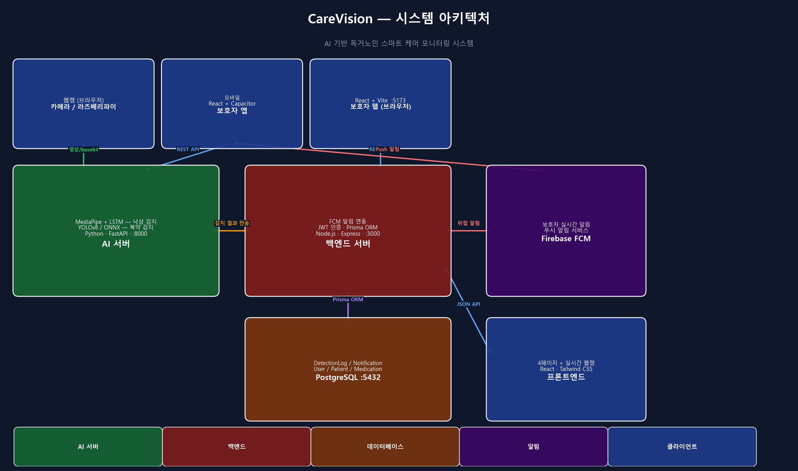
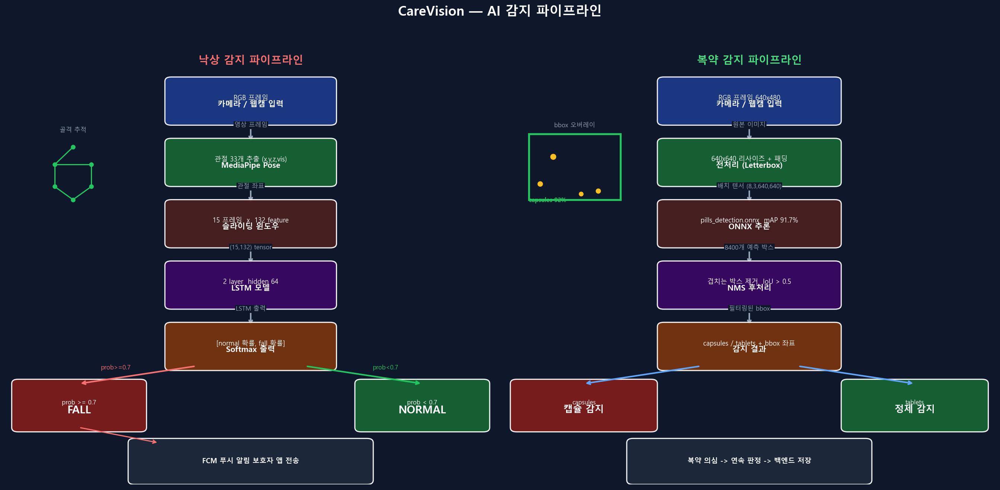
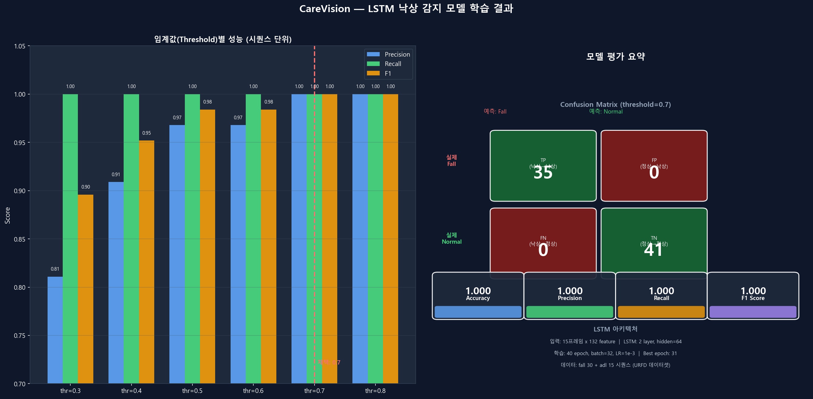
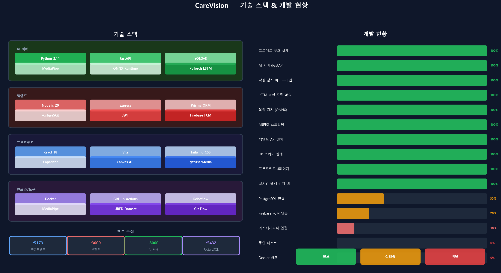

# CareVision 개발일지 — AI 기반 독거노인 스마트 케어 시스템

> 캡스톤 디자인 프로젝트 개발 과정과 AI 모델 학습 결과를 정리한 개발 일지입니다.

---

## 프로젝트 소개

고령화 사회가 심화되면서 혼자 사는 노인의 안전 문제가 점점 중요해지고 있습니다. **CareVision**은 카메라와 AI를 활용해 독거노인의 낙상과 복약 상태를 실시간으로 감지하고 보호자에게 즉시 알림을 보내는 스마트 케어 시스템입니다.

### 핵심 목표
- **낙상 감지**: 카메라 영상에서 낙상 자세를 실시간 감지 → 보호자 즉시 알림
- **복약 감지**: 약통/알약 객체를 인식해 복약 여부 모니터링
- **실시간 스트리밍**: 위급 상황 발생 시 보호자 앱에서 현장 영상 확인

---

## 시스템 아키텍처



전체 시스템은 3개 서버와 1개의 데이터베이스로 구성됩니다.

| 서비스 | 기술 | 포트 | 역할 |
|---|---|---|---|
| AI 서버 | Python · FastAPI | :8000 | 낙상/복약 감지 추론 |
| 백엔드 서버 | Node.js · Express | :3000 | API · 인증 · 알림 |
| 프론트엔드 | React · Vite | :5173 | 보호자 모바일 앱 UI |
| 데이터베이스 | PostgreSQL | :5432 | 환자/복약/감지 이력 |

**데이터 흐름**: 카메라가 프레임을 캡처 → AI 서버가 추론 → 감지 결과를 백엔드에 전송 → Firebase FCM으로 보호자에게 푸시 알림.

---

## AI 감지 파이프라인



### 낙상 감지 파이프라인

기존 단순 규칙(머리 Y좌표 > 골반 Y좌표)의 한계를 극복하기 위해 두 가지 방식을 구현했습니다.

**1단계 — MediaPipe Pose로 관절 좌표 추출**

MediaPipe가 프레임에서 사람의 관절 33개(코, 어깨, 팔꿈치, 골반, 무릎 등)의 `(x, y, z, visibility)` 좌표를 추출합니다. 이 좌표는 정규화되어 있어(0~1 범위) 카메라 해상도에 무관하게 동작합니다.

**2단계 — LSTM 모델로 시계열 분류**

단일 프레임이 아닌 **연속 15프레임**의 관절 좌표를 묶어 LSTM에 입력합니다. LSTM은 "서있다가 갑자기 쓰러지는" 시간적 패턴을 학습합니다.

```
입력: (15, 132) — 15프레임 × 33관절 × 4feature
LSTM: 2 layer, hidden_size=64
출력: [normal 확률, fall 확률]
```

**3단계 — 슬라이딩 윈도우로 실시간 추론**

웹캠에서 0.5초마다 프레임을 캡처해 AI 서버로 전송하면, 서버 내부에서 최근 15프레임을 버퍼링해 LSTM에 통과시킵니다. fall 확률이 **0.7 이상**이면 위급으로 판정합니다.

### 복약 감지 파이프라인

**YOLOv8 + ONNX 기반**으로 이미지에서 알약/캡슐 객체를 감지합니다.

1. 입력 이미지를 640×640으로 Letterbox 리사이즈 (비율 유지 + 패딩)
2. ONNX 모델 추론 → 8400개 예측 박스 생성
3. NMS(Non-Maximum Suppression)로 겹치는 박스 제거 (IoU > 0.5)
4. 신뢰도 0.4 이상인 박스만 반환

사용 모델: `seblful/pills-detection` (mAP 91.7%), 감지 클래스: `capsules`, `tablets`

---

## LSTM 낙상 감지 모델 학습



### 데이터셋

**UR Fall Detection Dataset (URFD)** — 폴란드 Rzeszów University 공개 데이터셋

- 낙상(fall) 시퀀스: **30개**
- 일상 동작(ADL) 시퀀스: **15개**
- 각 시퀀스: 약 130~160 프레임의 RGB 영상
- 사전 추출된 MediaPipe Pose landmarks (JSON 형식)

슬라이딩 윈도우(size=15, stride=3)로 샘플을 생성해 fall **460개**, adl **200개** 총 660개 훈련 윈도우를 확보했습니다.

### 모델 아키텍처

```python
class FallLSTM(nn.Module):
    def __init__(self):
        self.lstm = nn.LSTM(
            input_size=132,   # 33 관절 × 4 (x,y,z,visibility)
            hidden_size=64,
            num_layers=2,
            batch_first=True,
            dropout=0.3
        )
        self.head = nn.Sequential(
            nn.Linear(64, 32),
            nn.ReLU(),
            nn.Dropout(0.3),
            nn.Linear(32, 2)  # [normal, fall]
        )
```

### 학습 설정

| 하이퍼파라미터 | 값 |
|---|---|
| Optimizer | Adam (lr=1e-3) |
| Loss | CrossEntropyLoss (클래스 가중치 적용) |
| Batch Size | 32 |
| Epochs | 40 (Best: 31 epoch) |
| Train/Val Split | 80 / 20 |
| 클래스 불균형 보정 | fall 가중치 상향 (fall:adl = 2:1) |

### 평가 결과

**검증셋 (윈도우 단위)**

| Accuracy | Precision | Recall | F1 |
|---|---|---|---|
| **1.000** | **1.000** | **1.000** | **1.000** |

```
Confusion Matrix (threshold=0.7):
              예측: Fall  예측: Normal
실제 Fall        35          0       ← FN=0 (낙상 전혀 안 놓침)
실제 Normal       0         41       ← FP=0 (오탐 없음)
```

**임계값 스윕 (시퀀스 단위, 전체 45개)**

| threshold | Precision | Recall | F1 | FN |
|---|---|---|---|---|
| 0.30 | 0.811 | 1.000 | 0.896 | 0 |
| 0.50 | 0.968 | 1.000 | 0.984 | 0 |
| **0.70** | **1.000** | **1.000** | **1.000** | **0** |
| 0.80 | 1.000 | 1.000 | 1.000 | 0 |

→ **threshold 0.7 채택**: Recall 100% 유지하면서 FP=0 달성.

> ⚠️ 학습과 평가 데이터가 동일 데이터셋(URFD)이므로 점수가 낙관적일 수 있습니다. 실사용 환경에서 웹캠 직접 테스트가 필요합니다.

---

## 실제 영상 평가


URFD에서 영상 4개를 다운로드해 평가했습니다. (PNG 시퀀스 → mp4 변환)

| 영상 | 실제 | 최대 fall 확률 | 감지 구간 | 판정 |
|---|---|---|---|---|
| fall-01.mp4 | 낙상 | **0.991** | 60~160 프레임 (3.3초) | ✅ FALL |
| fall-05.mp4 | 낙상 | **0.991** | 37~151 프레임 (3.8초) | ✅ FALL |
| fall-10.mp4 | 낙상 | **0.992** | 41~130 프레임 (3.0초) | ✅ FALL |
| adl-01.mp4 | 정상 | **0.205** | — | ✅ NORMAL |

**결과: 4/4 정확**. 낙상 영상은 0.99+로 강하게 감지, 일상 동작은 0.21로 임계값(0.7)에 충분한 마진 확보.

### 주요 관찰

- 낙상 영상 공통 패턴: 서있는 구간은 0.0~0.2 → 넘어지기 직전부터 급격히 0.9+ 상승
- **감지 지연**: 낙상 시작 후 약 0.5~1초 이내에 FALL 판정 (15프레임 버퍼 = 0.5초 @ 30fps)
- adl 영상: 허리 숙이기, 걷기, 앉기 등에서도 오탐 없음

---

## 기술 스택 & 개발 현황



### 기술 스택 요약

**AI 서버**
- Python 3.11 · FastAPI · Uvicorn
- YOLOv8 (Ultralytics) · ONNX Runtime · PyTorch
- MediaPipe Pose · OpenCV

**백엔드**
- Node.js 20 · Express · Prisma ORM
- PostgreSQL · JWT · Firebase FCM
- bcryptjs

**프론트엔드**
- React 18 · Vite · Tailwind CSS
- Capacitor (모바일 빌드)
- Web APIs: `getUserMedia`, `Canvas API`, `fetch`

### 개발 현황

완료 (10/15):
- ✅ 전체 프로젝트 구조 및 GitHub 세팅
- ✅ AI 서버 (FastAPI + YOLOv8 + MediaPipe)
- ✅ 낙상 감지 파이프라인 + LSTM 모델 학습
- ✅ 복약 감지 파이프라인 (ONNX, mAP 91.7%)
- ✅ 백엔드 API 전체 (auth/patients/medications/detections/notifications)
- ✅ 프론트엔드 4페이지 (로그인/대시보드/환자상세/알림)
- ✅ 실시간 웹캠 감지 UI (바운딩박스 오버레이 + 낙상 상태 배지)

진행중:
- 🔄 PostgreSQL 연결 및 실 DB 마이그레이션
- 🔄 Firebase FCM 연동

미완:
- ❌ 라즈베리파이 카메라 연결
- ❌ 통합 테스트 · Docker 배포

---

## 웹캠 실시간 감지 UI 구현

프론트엔드에서 브라우저 웹캠을 통해 실시간으로 AI 감지를 수행하는 방식을 구현했습니다.

```
[브라우저 웹캠]
  ↓ 0.5초마다 프레임 캡처 (Canvas API)
  ↓ JPEG base64로 압축 (품질 70%)
  ↓ POST /detect/live → AI 서버 (FastAPI)
  ↓ 복약 bbox 좌표 + 낙상 확률 수신
  ↓ Overlay Canvas에 초록 박스 그리기
  ↓ 상태 배지 / 토스트 알림 업데이트
```

핵심 구현 포인트:
- `in-flight 추적`: 이전 요청이 아직 응답 중이면 다음 프레임 전송 스킵 → 서버 과부하 방지
- `언마운트 정리`: 컴포넌트 unmount 시 웹캠 트랙 자동 해제 (`getTracks().forEach(stop)`)
- `토스트 알림`: 낙상 상태 변화(normal → suspected → emergency) 감지 시 화면 상단에 색상별 알림 표시

---

## 트러블슈팅 & 배운 점

### 1. ONNX 모델 배치 크기 고정 문제
`pills_detection.onnx` 모델이 배치 크기 8로 고정되어 단일 이미지 추론이 불가능했습니다. 8장짜리 더미 배치를 만들고 첫 번째 슬롯에만 실제 이미지를 넣는 방식으로 해결했습니다.

### 2. LSTM vs 단순 규칙 기반
처음에는 "머리 Y < 골반 Y"라는 단순 규칙을 사용했습니다. 이 방식은 허리 숙이기, 바닥에 앉기 등에서 오탐이 발생했습니다. LSTM으로 전환 후 시간적 패턴을 학습하게 되어 오탐이 크게 줄었습니다.

### 3. MediaPipe Pose 인스턴스 공유 문제
여러 영상을 순차 평가할 때 MediaPipe Pose 인스턴스를 재사용하면 이전 영상의 트래킹 상태가 다음 영상으로 이어져 초반 프레임 감지가 크게 저하됩니다. 영상마다 새 인스턴스를 생성하고 `pose.close()`로 명시적으로 해제해야 합니다.

### 4. 윈도우 단위 vs 시퀀스 단위 평가
학습 시 윈도우 단위 val_acc는 1.0이 나왔지만, 이는 같은 시퀀스 내 윈도우들이 서로 높은 상관관계를 갖기 때문입니다. 실제 일반화 성능은 시퀀스 단위 평가나 외부 영상 테스트로 검증해야 합니다.

---

## 다음 계획

1. **LSTM 파이프라인 통합**: `fall_detector.py`에 LSTM 모델 로드 코드 추가, 기존 규칙 기반 fallback 유지
2. **외부 데이터 검증**: 다른 출처의 낙상 영상으로 모델 일반화 성능 검증
3. **실 DB 연결**: PostgreSQL 마이그레이션 후 목업 데이터 제거
4. **FCM 알림**: Firebase 설정 완료 후 보호자 푸시 알림 동작 확인
5. **라즈베리파이**: 실제 가정 환경에서 카메라 설치 및 종단간 테스트

---

*작성일: 2026-04-10*
*팀: 컴퓨터공학과 캡스톤 디자인 6팀*
*GitHub: [silhouette33/carevision](https://github.com/silhouette33/carevision)*
